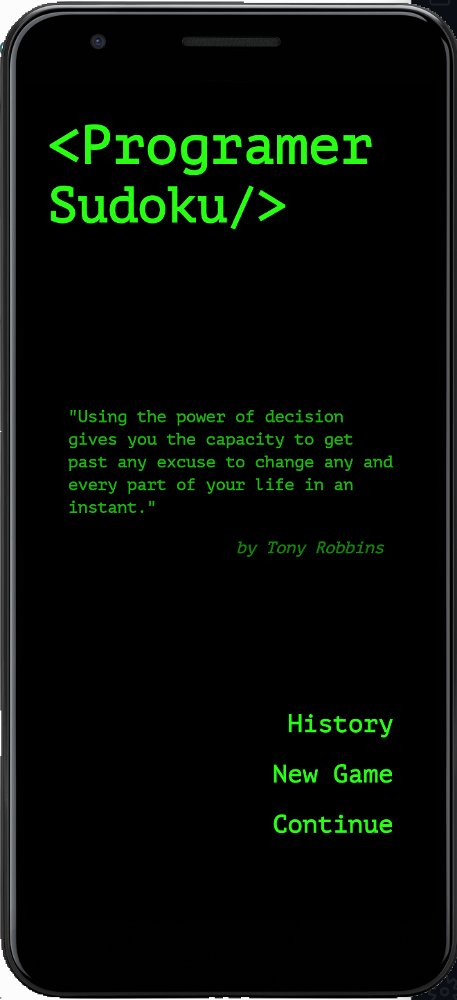
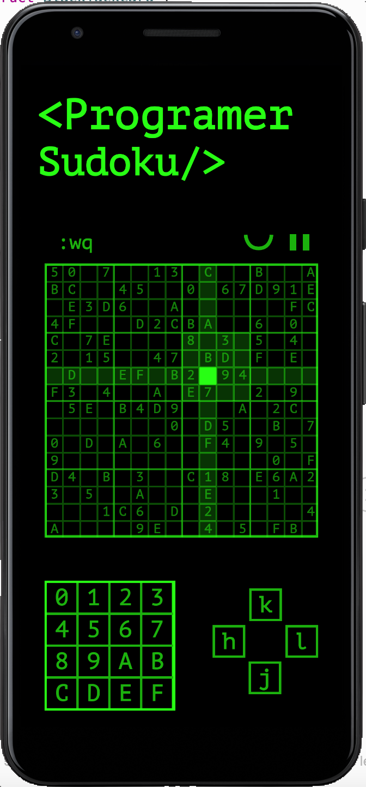

# SudokuForProgrammer
Source code of android Hex-base Sudoku App ~~for programmers~~ with classical terminal theme. In this app, you can

- Gain fun by discovering memes
- Struggle with super hard sudoku puzzle
- Get inspiration from famous quotations
- Save and continue game in a friendly way
- Appreciate beautiful terminal theme
- etc..

## Screenshots

## Todos

At the mean time, we are still improving user experience by adding extra functionalities into it.

- [X] Faster puzzle generator
- [X] Finish History activity connectivity
- [ ] Add long press controller to game control button
- [ ] What to do if the player makes a mistake
- [X] Erase grid if the game is paused
- [ ] Adapative UI settings
- [ ] OCR sudoku solver
- [X] Add sound effects
  - [X] Press sudoku unit: [CLICK]
  - [X] Press num button: [MECHANIC KEYBOARD]
